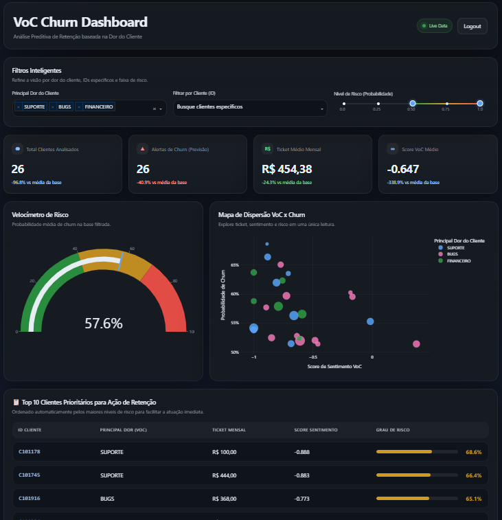

# Customer Churn Prediction 2025: ML Pipeline + Interactive Dashboard

Este repositório apresenta uma solução completa de **Customer Churn Analytics**, construída como continuidade do projeto de **[Voice of Customer (VoC)](https://github.com/schenkel94/VoC)** do portfólio. A proposta aqui é transformar a Voz do Cliente em ação prática de retenção, unindo duas entregas complementares no mesmo fluxo:

* **Notebook de Machine Learning no Databricks** para calcular a probabilidade de churn por cliente.
* **Dashboard web interativo** para priorização de retenção com foco na principal dor reportada pelo cliente.

O resultado é uma visão de ponta a ponta: da camada analítica e preditiva até a camada visual de decisão, pronta para uso em contextos de CRM, Customer Success e gestão executiva.

## Dashboard Interativo
Clique na imagem abaixo para abrir a versão [interativa do dashboard](https://churn-7uiy.onrender.com/dashboard/), criado para transformar a saída do modelo em uma ferramenta acionável de retenção:

*Preview do dashboard interativo com foco em risco, ticket, sentimento e principal dor do cliente.*

---

## Inteligência do Projeto

O projeto foi estruturado como uma jornada analítica conectada ao pipeline anterior de VoC:

### 1. Origem dos Dados: Voice of Customer
O ponto de partida é a base enriquecida com sinais de relacionamento do cliente, incluindo:

* **Score de sentimento VoC**
* **Categoria principal do feedback**
* **Histórico transacional e cadastral**

Esses sinais alimentam a camada Silver e conectam a percepção do cliente com o risco futuro de evasão.

### 2. Modelagem Preditiva no Databricks
O arquivo [`churn_prediction_databricks.ipynb`](./churn_prediction_databricks.ipynb) executa a etapa analítica principal:

* **Leitura da camada Silver** com dados tratados e estruturados.
* **Feature Engineering** com variáveis como `taxa_uso_valor` e `dias_desde_assinatura`.
* **Tratamento das categorias** de VoC para uso no modelo.
* **Treinamento de Machine Learning** com `RandomForestClassifier`.
* **Avaliação do modelo** por métricas como **Acurácia** e **AUC-ROC**.
* **Geração da camada Gold** com `id_cliente`, `probabilidade_churn` e `previsao_final`.

Essa camada Gold representa a saída preditiva pronta para ser consumida por aplicações de negócio.

### 3. Dashboard Premium para Retenção
Com base na camada Gold e no contexto comportamental da Silver, a aplicação web transforma os resultados do modelo em uma visão executiva e operacional:

* **KPIs de impacto** com comparação contra a média da base.
* **Gauge de risco médio** para leitura rápida do cenário filtrado.
* **Scatter plot** relacionando sentimento, risco e ticket.
* **Tabela Top 10 de clientes prioritários** para ação de retenção.
* **Filtro por principal dor do cliente**, permitindo analisar churn pela perspectiva da Voz do Cliente.

Um ponto central da solução é a regra de negócio aplicada na interface:

* A coluna `categoria_principal_voc` foi convertida para **Principal Dor do Cliente**, reforçando a leitura orientada à ação e não apenas ao dado técnico.

---

## Arquitetura da Solução

O fluxo do projeto pode ser resumido da seguinte forma:

1. **VoC / NLP** gera sinais de sentimento e categorização.
2. **Base Silver** consolida histórico de clientes e atributos analíticos.
3. **Notebook no Databricks** executa feature engineering e modelagem de churn.
4. **Base Gold** armazena a probabilidade prevista por cliente.
5. **Dashboard em Dash + Plotly** entrega exploração visual, filtros e priorização de retenção.

---

## Tecnologias e Ferramentas

* **Linguagem**: Python
* **Processamento Analítico**: Pandas, PySpark
* **Machine Learning**: Scikit-learn
* **Infraestrutura Analítica**: Databricks Free Edition
* **Aplicação Web**: Dash, Plotly, Flask
* **Deploy**: Render
* **Visual Analytics / UX**: Dashboard Dark SaaS customizado com CSS

---

## Estrutura de Arquivos

* [`churn_prediction_databricks.ipynb`](./churn_prediction_databricks.ipynb): notebook principal com feature engineering, treinamento e geração da camada Gold.
* `churn_silver_2025.csv`: base de entrada com histórico, atributos cadastrais e sinais VoC.
* `churn_gold_2025.csv`: saída do modelo com probabilidade de churn e predição final.
* [`app.py`](./app.py): aplicação web do dashboard interativo.
* [`requirements.txt`](./requirements.txt): dependências da aplicação.
* [`Procfile`](./Procfile): comando de start para deploy no Render.
* [`churn.png`](./churn.png): imagem de preview do dashboard.

---

## Valor de Negócio

Mais do que prever churn, este projeto foi pensado para responder a uma pergunta prática:

**Quais clientes devem ser abordados primeiro, por quê, e com base em qual dor principal?**

Com isso, a solução ajuda a:

* priorizar clientes de maior risco;
* cruzar risco com ticket mensal;
* entender o papel da Voz do Cliente na evasão;
* criar uma ponte entre analytics, operação e tomada de decisão.

---

## Autor
**Mário Schenkel** - Data Specialist

* [Meu Portfólio](https://schenkel94.github.io/portfolio/)
* [LinkedIn](https://www.linkedin.com/in/marioschenkel/)
